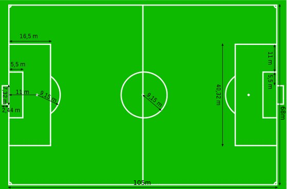
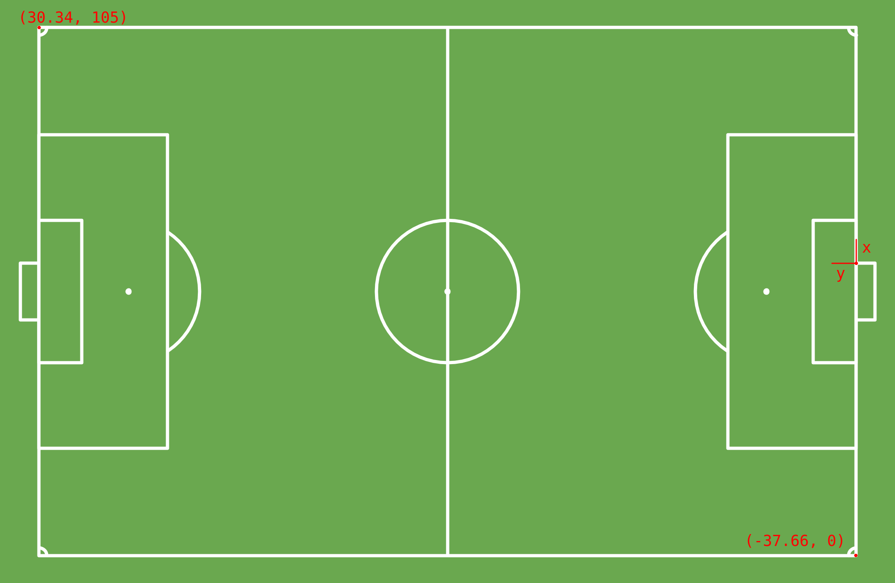

# Direct Linear Transformation

Neste trabalho implementamos em Python uma calibração de câmera com o método DLT, para estimar a matriz de homografia em fotos de um campo de futebol.

Consideramos as seguintes medidas padronizadas de um campo de futebol:

Montamos um sistema de coordenadas definindo como origem a trave direita da goleira da direita:

Os resultados podem ser conferitos no [relatório](docs/relatorio.pdf).
